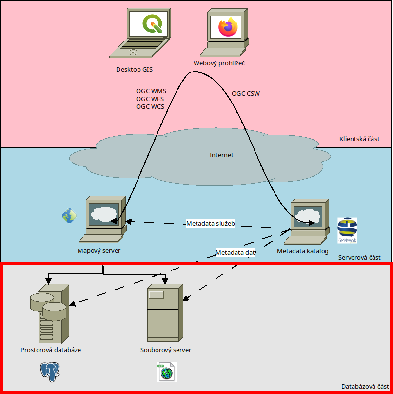

Prostorová databáze
===================

Prostorová mohou být uložena buď v souborech nebo v databázových systémech.

        Nákres infrastruktury prostorových dat - databázová část

Souborová databáze
------------------
Vhodný formát souboru záleží na charakteru dat a nabízených služeb. Prostorová
data bývají často velká (řádově GB), proto se pro lepší stahování a menší zátěž
na serveru volí různé způsoby kouskování dat (např. po mapových listech, po
administrativních jednotkách, letech pořízení, ...).

`Rastrová <https://training.gismentors.eu/open-source-gis/formaty/rastr.html>`_ a `vektorová <https://training.gismentors.eu/open-source-gis/formaty/vektor.html>`_ data mají několik různých `formátů <>`_ (řádově 100) - záleží na
software, ve kterém jsou data vytvořena, kompresních algoritmech a podobně. Je
běžnou praxí v GIS konvertovat data mezi formáty.

U obou typů dat je potřeba hlídat, aby zvolený datový formát měl následující
vlastnosti:

* Podle typu dat zvládl pracovat i s velkými objemy dat (100 000+ prvků)
* Nesl si informaci o souřadnicovém systému dat
* Zvládl pracovat i s delšími názvy atributů
* Bylo možné automaticky hlídat schema dat
* Byla možná uspokojivá komprese
* Prostorový databázový index
* Byl otevřený (de-facto i de-jure)

Datový formát vhodný pro distribuci dat nemusí být vždycky stejný, jako datový
formát vhodný pro publikaci dat.

Nejčastější dnes používané typy vektorových prostorových dat:

* ESRI Shapefile
* OGC GeoPackage
* ISO GML
* GeoJSON
* ...

Nejčastější dnes používané typy rastrových prostorových dat:

* GeoTIFF
* GeoPackage
* JPEG/PNG/TIFF
* ...

Databáze prostorových dat
-------------------------
Prostorová data se běžně ukládají do `databázových systémů (SQL i NoSQL) <https://training.gismentors.eu/open-source-gis/databaze/index.html>`_, jako
jsou PostgreSQL, Oracle, MSSQL, a další. Bývá to realizováno formou nadstaveb ke
standardním databázím.

Ve světě otevřeného software se nejvíce využívá nadstavba `Postgis
<https://postgis.org>`_ pro databázový systém `PostgreSQL <https://www.postgresql.org/>`_

Do databází lze ukládat i rastrová data. To se ale nejvíce využívá pro tzv.
cache (předgenerovanou databázi obrázků/dlaždic pro další publikaci) ve formě
souborové databáze (nejčastěji postaných okolo technologie `SQLite
<https://sqlite.org>`_).

    Dlaždicovací schéma podle https://www.researchgate.net/figure/Google-Maps-Tiling-Scheme-the-first-three-zoom-levels-the-tiles-and-their-numbering_fig1_321064657
