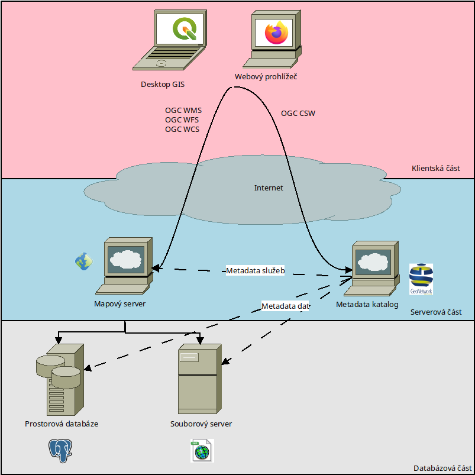

.. Spatial data infrastructure documentation master file, created by
   sphinx-quickstart on Tue Jun 15 12:00:09 2021.
   You can adapt this file completely to your liking, but it should at least
   contain the root `toctree` directive.

################################################################
Spatial data infrastructure - infrastruktura pro prostorová data
################################################################

`Spatial data infrastructure <https://en.wikipedia.org/wiki/Spatial_data_infrastructure>`_
je rámec pro práci s prostorovými (geografickými) daty a metadaty. 

Prostorová infrastruktura se nejčastěji skládá z následujících komponent:

Klient
        software pro zobrazení, dotazování a analýzu prostorových dat (webový
        prohlížeč, destkop GIS)
Mapový server
        software, který čte data z prostorových databází a distribuuje
        dále ke klientovi ať už v surové nebo zpracované formě prostřednictvím
        tzv. prostorových služeb.
Katalogová služba
        pro vyhledávání a dotazování se na metadata prostorových
        dat a služeb a dalších zdrojů
Služby pro stahování a prohlížení prostorových dat (spatial data services)
        .
Služby zpracování dat (processing services)
        .
Prostorová databáze pro ukládání dat
        Programy GIS (webový, desktopový) pro tvorbu a udržování prostorových dat.

        Nákres infrastruktury prostorových dat

V EU pokrývá problematiku SDI iniciativa `INSPIRE
<https://inspire.ec.europa.eu>`_

Principy INSPIRE, na kterých se staví prostorová infrastruktura v Evropě:

* Data jsou sbírána pouze jednou a udržována na místě, které je jejich sběru co
  nejblíže.
* Mělo by být možné "bezešvě" kombinovat data z různých zdrojů v celé Evropě a
  sdílet je mezi mnoha aplikacemi a uživateli.
* Informaci sbíranou na nějakém měřítku by mělo být možné ji sdílet pro další
  měřítka - detailní pro konkrétní aplikaci, ale i generalizovanou pro
  potřeby strategického plánování.
* Prostorová informace, která je potřebná pro dobré řízení na všech úrovních,
  musí být dostupná transparentně.
* Nalézt geografickou informaci musí být možné. Musí být zřejmé jak smí být s
  s touto informací naloženo a za jakých podmínek smí být využita.

.. warning:: :red:`Pracovní verze školení, která je aktuálně ve vývoji!`

.. toctree::
        :maxdepth: 2
        :caption: Obsah:

        databaze
        server
        klient
        katalog
        spatial_data_services

Licence dokumentu
=================

Text školení je licencován pod `Creative Commons Attribution-ShareAlike 4.0 International License <http://creativecommons.org/licenses/by-sa/4.0/>`_.

.. figure:: images/cc-by-sa.png 
   :width: 110px
              
Verze textu školení: |release| (|today|)

Autoři
------

Za `GISMentors <http://www.gismentors.cz/>`_:

* `Jáchym Čepický <http://www.gismentors.cz/mentors/cepicky>`_ 
    
.. only:: latex

   Online HTML verze textu školení je dostupná na adrese: http://training.gismentors.eu/sdi/

Zdrojové texty školení jsou dostupné na adrese:
https://github.com/GISMentors/sdi

