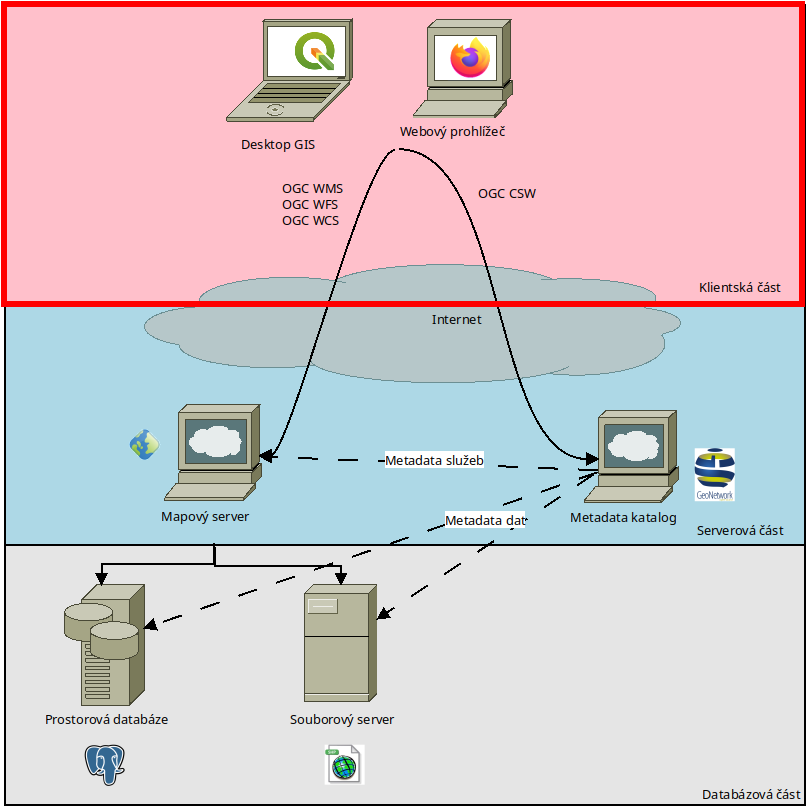
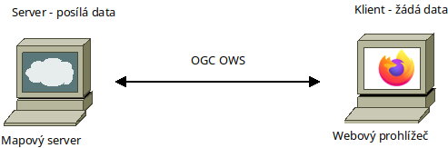
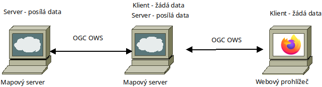

Klientské aplikace
##################

        Nákres infrastruktury prostorových dat - klientská část

Zatím co servery nejsou určené k přímou interakci s lidmi, klientské aplikace
jsou. Klientská aplikace má na jedné straně schopnost komunikovat se serverem
prostřednictvím služeb pro prostorová data, na druhé straně poskytuje (pokud
možno) příjemné a intuitivní prostředí pro interakci s uživatelem (člověkem).

        Vztah server-client

Klientské aplikace mohou být (z pohledu uživatele) jednoduché - interaktivní okno s mapičkou u
vědeckého článku, přes tzv. mapový geoportál (webovou aplikaci s možností
přidávání dalších vrstev) až po desktopové programy.

Jako "klient" se může tvářit i mapový server v okamžiku, kdy kombinuje
(kaskáduje) data z jiných serverů pro jednoho uživatele.

        Vztah server-client|server-client

Desktopový klient
=================

Jedná se nejčastěji o aplikci GIS, která umožňuje kombinovat lokální data
(uložená na stejném počítači jako program) - například data pořázená pomocí GPS,
fotografie a podobně - spolu s daty dostupnými ze vzdálených serverů
prostřednictvím služeb pro prostorová data.

Nejvíce se jako otevřený software využívá program QGIS.

Webový klient
=============
Jedná se aplikaci, naprogramovanou pomocí jazyka JavaScript (ECMA Script) která
běží v prostředí webového prohlížeče (Firefox, Chrome, ...). Webové aplikce
využívají (až na výjimky) pouze data z mapových serverů s pomocí prostorových
webových služeb.

Na rozdíl od všech ostatních komponent SDI bývají weboví klienti programovaní
na míru konkrétním potřebám. Existují sice projekty, které se snaží být
dostatečně obecné (GeoNode), v praxi se ale nejvíc využívá vývoj na zakázku.
Jediná společná vlastnost u otevřených software (vyjma nějakého dialektu jazyka
JavaScript) je použití otevřených knihoven pro zobrazení mapy:

* OpenLayers - určené spíše pro programátory s povědomím o prostorových datech,
  jejich obvyklé struktuře a datovém modelu
* Leaflet - určené spíše pro vývojáře orientované na vývoj webových aplikací,
  kteří o prostorových datech zase tolik neví, ale rádi by do své aplikace
  zakomponovali mapu.
