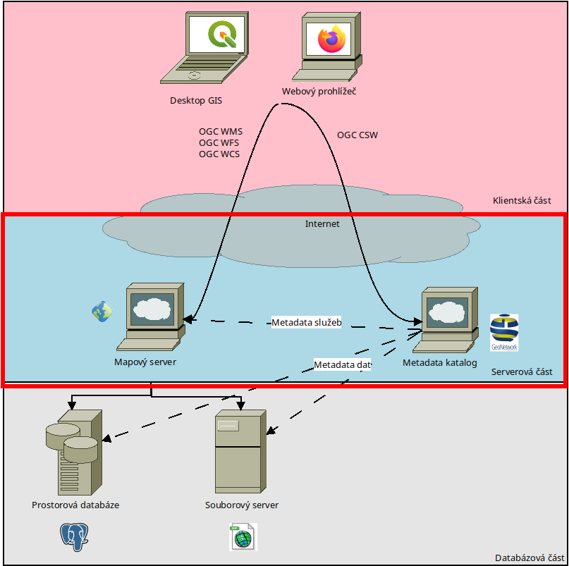

Mapový server
#############

        Nákres infrastruktury prostorových dat - serverová část

Mapový server je program, který má přístup k datům uloženým k databázi a který
zároveň čeká na požadavky klientů (desktop GIS, webový prohlížeč, jiný program
...) aby na základě těchto požadavků odeslal požadovaná data.

Mpový server obvykle nemá grafické uživatelské rozhraní určené pro klienta -
tedy v předklu, neobsahují mapovou aplikaci určenou pro běžné lidi. Nejsou
určené pro interakci s lidmi, spíše s klientskými programy (mapovými aplikacemi,
desktop GIS). S vnějším světem komunikují prostřednictvím služeb pro prostorová
data (spatial data services).

Vlastností mapových serverů bývá, že jsou optimalizovány na velký počet
požadavků na (velká) data. Jsou přímo napojeni na prostorovou databázi
(souborovou nebo databázovou) a snaží se s co nejmenší zátěží na systém odbavit
požadavky na data.

Data mohou vracet v surové podobě (vektory, rastry, záznamy ze senzorových sítí,
...) nebo v podobě předzpracovaných mapových dlaždic - obrázků. Jednotlivé
obrázky pak obsahují otisk dat včetně legendy, ze kterých se dá složit
interaktivní mapa určená pro lidského pozorovatele.

Nejčastější mapové servery s otevřeným zdrojovým kódem:

* `GeoServer <https://geoserver.org>`_
* `MapServer <https://mapserver.org>`_
* `QGIS Server <https://qgis.org>`_
* `Mapnik <https://mapnik.org>`_

