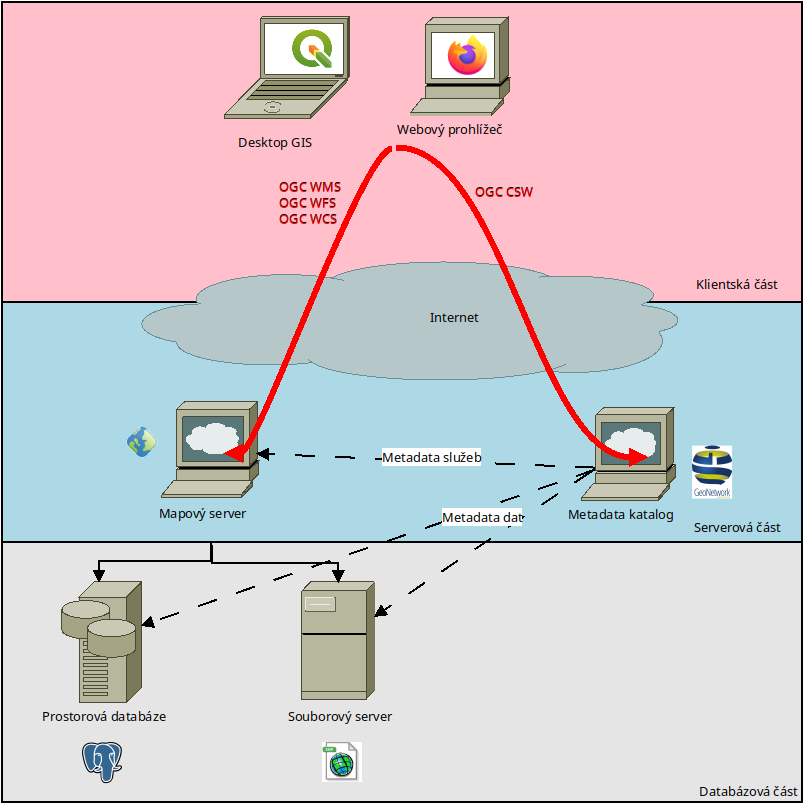

Služby pro prostorová data - Spatial data services
##################################################

        Nákres infrastruktury prostorových dat - prostorové služby

Služby pro prostorová data je (ideálně otevřený) standard (kontrakt), který zprostředkuje
komunikaci mezi libovolným klientem a libovolným serverem. Tyto standardy mohou
být vytvářeny nezávislou organizací nebo soukromým subjektem. Tyto standardy
mohou být otevřené nebo i uzavřené.

Evropská iniciativa INSPIRE staví vesměs na otevřených standardech konsorcia OGC
(Open Geospatial Consortium). Tato organizace se zaměřuje na tvorbu otevřených
standardů pro prostorová data - formátů, služeb, ... Na tvorbě těchto standardů
pracují zejména dobrovolníci z vládních a neziskových organizací a firem.

Mezi základní sadu služeb patří tzv. `Open Web Services (OGC OWS)
<https://training.gismentors.eu/open-source-gis/standardy/ogc/index.html>`_:

* Web Map Service (WMS)
* Web Map Tiled Service (WMTS)
* Web Feature Service (WFS)
* Web Coverage Service (WCS)
* Web Processing Service (WPS)
* Catalogue service for Web (CSW)

Pomocí těchto služeb se implementují požadavky iniciativy INSPIRE na služby pro

* vyhledávání (discovery) - OGC CSW
* prohlížení (view) - OGC WMS/OGC WMTS
* stahování (download) - OGC WCS, WFS

.. note:: Pro stahovací službu se dále využívá formát ATOM pro statické soubory.
        OGC WFS a WCS jsou vhodnější pro menší objemy dat v menších datasetech.
        Jejich výhoda je možnost dynamického filtrování dat na straně serveru.
        Jejich nevýhoda je, že  při velkých objemech dat dochází k enormní
        zátěži na serverovou infrastrukturu a tam, kde stačí "vystavit pár
        souborů na FTP" zavádí celkem komplexní řešení (databáze, server,
        management).

Tyto služby tvoří komunikační pojítko (kontrakt) mezi jednotlivými komponentami
systému. Díky tomuto kontraktu by mělo být možné, jednotlivé komponenty nahradit
jeden za druhý - je-li to potřeba.

.. note:: Vedle OGC OWS existuje ještě ArcGIS rest services. Jedná se o
        proprietární standard, který využívají pouze servery ArcGIS od firmy
        ESRI. Někteří otevření klienti umí komunikovat i s tímto standardem, ale
        proces vzniku této normy je z logiky věci uzavřený. Není druhý server,
        který by implementoval REST API, mimo servery ArcGIS.

